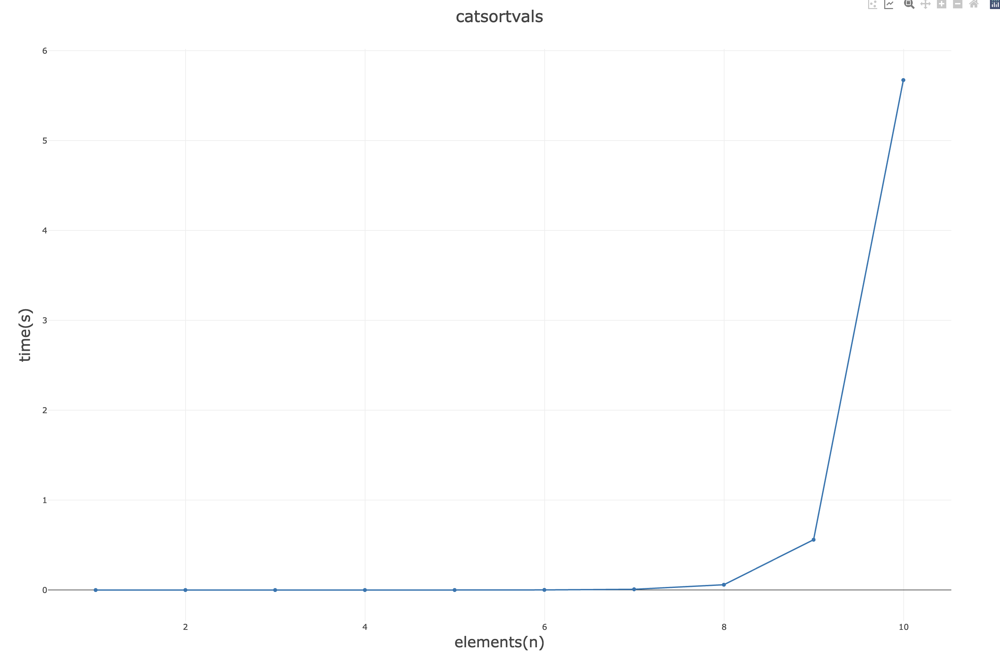

# Catsort

## A new amazing sorting algorithm

Very simple idea:
1. if array is sorted, you're done
2. while array is not sorted
  3. pick a random element
  4. swap it either left or right randomly
  5. go back to step 1

First Catsort implementation written by Cat#6666 on Discord

I just added some timing to check initial complexity.

Running it for 10 elements took a significant amount of time, it is an exercise left for the reader to run it for higher element arrays.

We suspect it's factorial-related somehow but do not have enough knowledge to prove it.

Csvplot.com did the graph below

